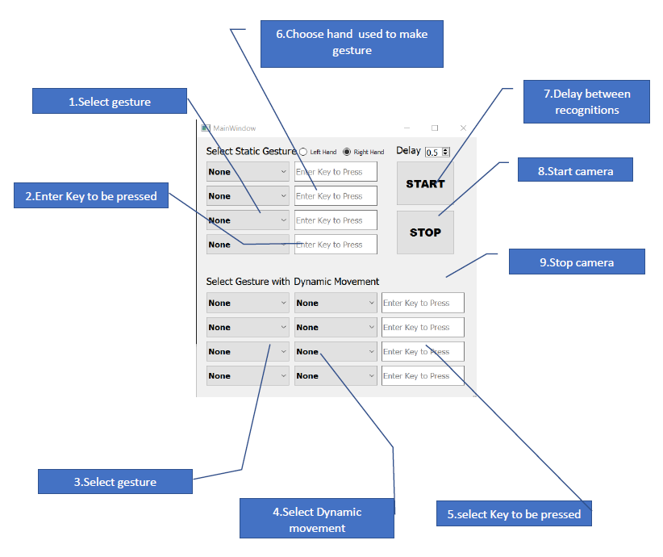

# Custom Gesture Control Application Guide

```
➢ This application performs actions ,on desktop/laptop, choosen by user.

➢ Actions are infact key presses which are triggered programatically when a
   certain gesture is detected.

➢ User has to select a gesture and associate a key press with it.

➢ Follow the steps given to get started.
```
- ## Getting Started 

- To run : Custom_Gesture_Control - > test.exe
- How to use application? - [Custom Gesture Control Guide](https://github.com/atharvakale31/Custom_Gesture_Control/blob/master/CGC_Guide.pdf)
- [Application Link](https://drive.google.com/file/d/1nlWgWMKu9f328SUHU_JSBwErqEyR5Bv8/view?usp=sharing)

-
