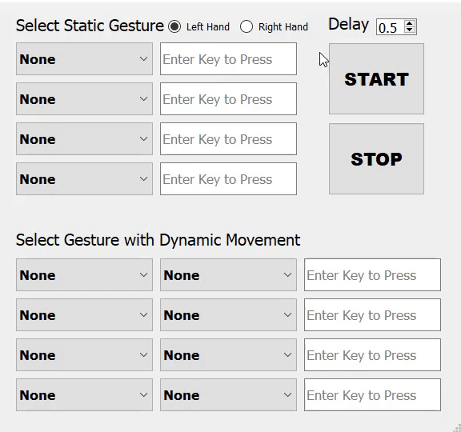
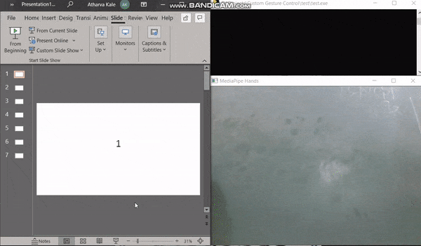

# Custom Gesture Control Application Guide

```
➢ This application performs actions ,on desktop/laptop, choosen by user.

➢ Actions are infact key presses which are triggered programatically when a
   certain gesture is detected.

➢ User has to select a static/dynamic hand gesture and associate a key press with it.

➢ Follow the steps given to get started.
```
 ## Getting Started 

- To run : Custom_Gesture_Control - > test.exe
- ### **How to use application**? - [Custom Gesture Control Guide](https://github.com/atharvakale31/Custom_Gesture_Control/blob/master/CGC_Guide.pdf)
- ### Desktop Application : [Custom_Gesture_Control.rar](https://drive.google.com/file/d/1nlWgWMKu9f328SUHU_JSBwErqEyR5Bv8/view?usp=sharing)


 ## Working Example:
- Here, 1 (index finger open) is assigned to up arrow key.  
- 2 (thumb and index finger open) is assigned to down arrow key.  



- We control PowerPoint Slides using above Gestures.



## Tools and Frameworks used:
- Google MediaPipe Hands
- Python, OpenCV
- pyQt5 designer
- pyinstaller

## Files description:
- main.py : whole application code (including GUI)
- gui.py : Independent GUI code. (.ui --> .py)
- pyQt5_designer.ui : UI file generated by pyQt5 designer. 
- CGC_Guide : Application Guide.

## Contributing
Pull requests are welcome. For major changes, please open an issue first to discuss what you would like to change.  

## Action Items
- [ ] Improve Code Readability.
- [ ] Add support for mouse pointer control.
- [ ] Dynamic UI to accommodate more Gesture-Key pairs.
- [ ] Improve and implement Slide dynamic gesture.
- [ ] Support for multiple Static gestures to be associated with single Dynamic movement.
